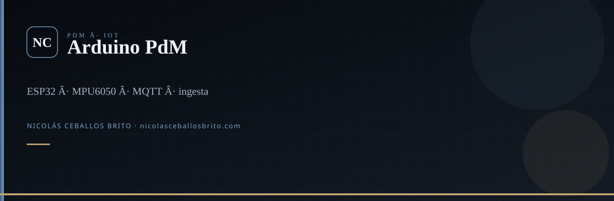
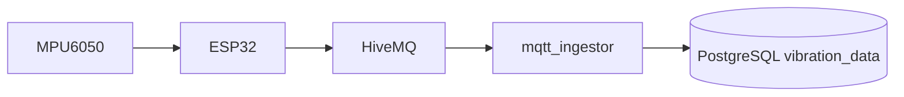

  

 

**Capa IoT del PdM.** El ESP32 mide, el broker transporta, el ingestor guarda.

## Qué es

Firmware Arduino (MPU6050 triaxial) que publica JSON de vibración a HiveMQ, más un servicio Python `mqtt_ingestor` que escribe PostgreSQL. PdM-Manager no habla con el chip: lee la tabla que llena este repo.

## Qué hace el código

- Muestreo ~10 s, payload JSON al tópico `GL_Ingenieros/sensores/vibracion`
- Comandos MQTT (`restart`, `status`)
- Cola offline en SPIFFS (~50 registros) si cae la red
- Reconexión Wi-Fi/MQTT y NTP
- Ingestor con plantilla systemd

## Carpetas

| Ruta | Qué |
|---|---|
| `ESP32_Sensor/` | Firmware y docs de placa |
| `mqtt_ingestor/` | Python → Postgres |
| `libraries/` | Adafruit y clientes (terceros) |

## Relación

Este repo **alimenta** [PdM-Manager](https://github.com/Nico2603/PdM-Manager). No abras credenciales de `credentials.h` en un fork público.

## Agentes

`.agents/skills/` — Superpowers, `nicolas-identity`, `find-skills`. `graphify update .`

---

**Nicolás Ceballos Brito** · Ingeniero en Sistemas y Telecomunicaciones (UCP 2025)  
CTO · Prosavis · Pereira, Colombia

[nicolasceballosbrito.com](https://nicolasceballosbrito.com)
·
[GitHub](https://github.com/Nico2603)
·
[LinkedIn](https://www.linkedin.com/in/nicolas-ceballos-brito/)
·
[X](https://x.com/NicolasCBrito)
·
[Instagram](https://www.instagram.com/nico_ceballos26/)
·
[Hugging Face](https://huggingface.co/Flackoooo)
·
[Email](mailto:nicolasceballosbrito@gmail.com)

